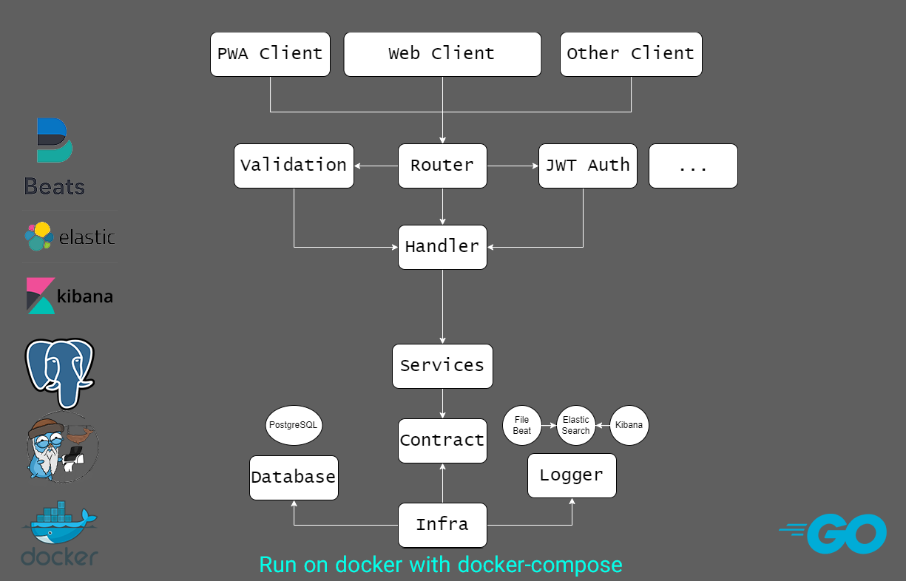
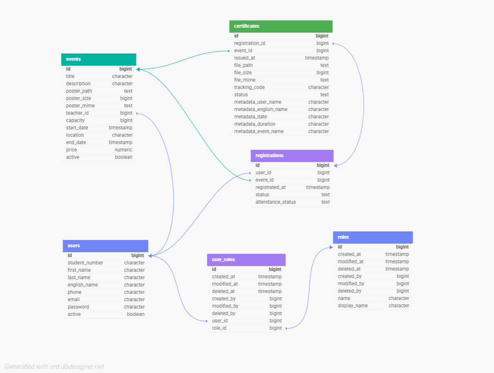

<div>
  
</div>

###

<p align="left">A production-ready backend system for managing events and issuing digital certificates.<br>Built with Go, designed with clean, scalability, observability, and DevOps-friendly architecture in mind.<br>This service allows organizations to create and manage events, and distribute certificates automatically with PDF generation and structured logging.</p>

###

<h2 align="left">🏗️ System Architecture</h2>

###

<div align="center">
  
</div>

###

<h2 align="left">🗄️ Database</h2>

###

<div align="center">
  
</div>

###

<h2 align="left">✨ Features</h2>

###

<p align="left">🎟️ Event & certificate management<br>📄 Automatic PDF certificate generation (Gotenberg)<br>🔐 JWT authentication & authorization<br>⚡ High-performance REST API (Gin)<br>🗄️ PostgreSQL main database<br>🧠 Redis caching layer<br>📊 Centralized logging with ELK stack<br>🐳 Fully dockerized environment<br>📦 Production-ready architecture<br>🧪 Input validation<br>⚙️ Configurable via environment variables<br>🔎 Observability ready</p>

###

<h2 align="left">📦 Docker Hub Image</h2>

###

If you pushed your image to Docker Hub, use:

```bash
docker pull frzdamr/event-manager-api:latest
```
###

<h2 align="left">🚀 Run with Docker Compose (Recommended)</h2>

###

1️⃣ Clone project

```bash
git clone https://github.com/YOUR_USERNAME/YOUR_REPO.git
cd YOUR_REPO<br>
```
2️⃣ Run all services

```bash
docker compose up -d
```
This will start:
API server
PostgreSQL
Elasticsearch
Kibana
Filebeat
Gotenberg

3️⃣ Access services
Service	URL

| service | url |
| --- | --- |
| API	| http://localhost:5005 |
| Kibana |	http://localhost:5601 |
| PostgreSQL |	http://localhost:5432 |
| Gotenberg | http://localhost:3000 |

###

<h2 align="left">⚙️ Configuration</h2>

###
Project uses Viper for configuration.

Example structure:

```
config/
├── config-development.yaml
├── config-docker.yaml
├── config-production.yaml
```
###

<h2 align="left">📄 API Documentation</h2>

###

Postman collection:

`docs/postman_collection-document.json` Import into Postman to test endpoints.

###

<h2 align="left">📊 Logging Architecture</h2>

###

<p align="left">Application logs → Filebeat<br>Filebeat → Elasticsearch<br>Elasticsearch → Kibana</p>

Structured logging via:

- Zap
- Zerolog

###

<h2 align="left">🛠️ Run Locally (Without Docker)</h2>

###
```
go mod tidy
go run cmd/main.go
```

###

<h2 align="left">📌 TODO</h2>

###
- [ ] Font-End Application
- [ ] Email sending
- [ ] Integration Test
- [ ] CI/CD pipeline
- [ ] Kubernetes deployment

###

<h2 align="center">⭐ Support</h2>

###

<p align="center">If you like this project, give it a star ⭐ on GitHub.</p>

###
